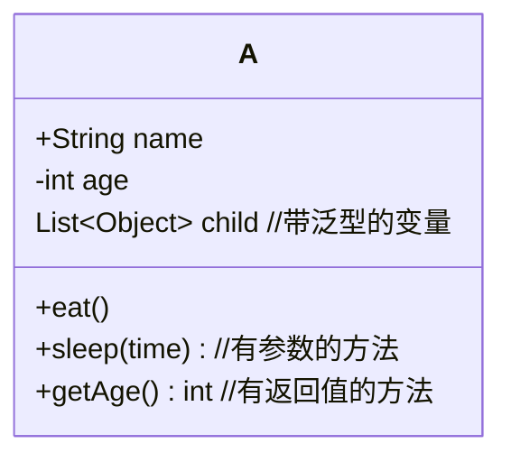
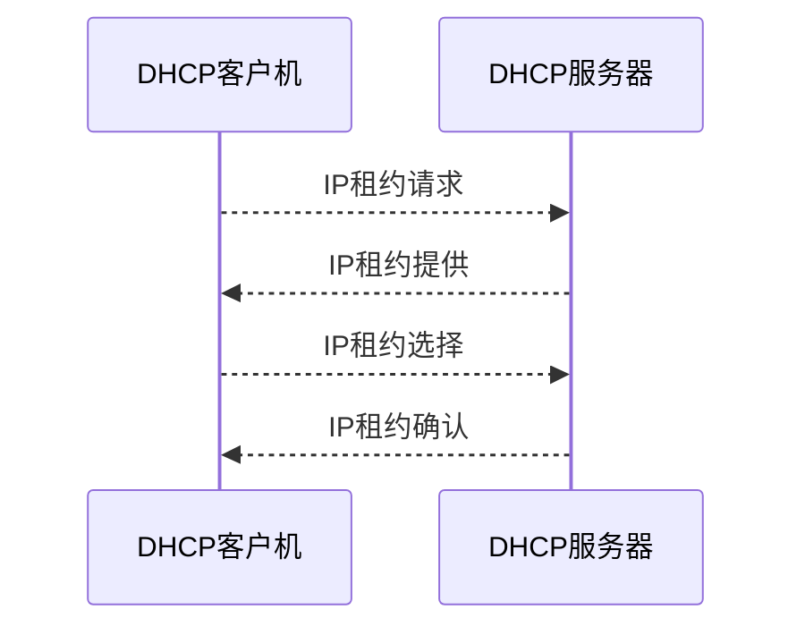

# h1

```mermaid
classDiagram
class A
A : +String name
A : -int age
A : List~Object~ child    //带泛型的变量
A : +eat()
A : +sleep(time)          //有参数的方法
A : +getAge() int         //有返回值的方法
```

```mermaid
sequenceDiagram
DHCP客户机-->>DHCP服务器: IP租约请求
DHCP服务器-->>DHCP客户机: IP租约提供
DHCP客户机-->>DHCP服务器: IP租约选择
DHCP服务器-->>DHCP客户机: IP租约确认
```
